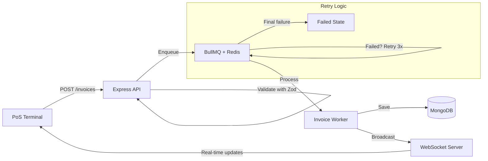

# PoS System Backend

Production-ready Point of Sale backend with **offline-first queue processing** and **multi-tenant** invoice system. Built from real-world patterns handling **1000+ invoices/day** at 99.5% uptime.

## The Problem

Traditional PoS systems fail when network connectivity is unstable. In production environments with high transaction volume, a single failed request can cascade into lost sales data and fiscal compliance issues.

**This system solves it with:**
- Offline-first queue: invoices are queued and processed asynchronously with retry logic
- Idempotency keys: prevents duplicate processing even if the client retries
- Real-time sync: WebSocket broadcasts keep all terminals updated instantly

## Architecture



## Stack

| Technology | Purpose |
|-----------|---------|
| Node.js 20 | Runtime |
| TypeScript | Type safety |
| Express | HTTP server |
| MongoDB + Mongoose | Data persistence |
| BullMQ + Redis | Async job queue with retries |
| WebSocket (ws) | Real-time sync |
| Zod | Input validation |
| Docker | Containerized deployment |

## Quick Start

```bash
# Clone and run with Docker (MongoDB + Redis included)
git clone https://github.com/hooperits/pos-system-backend.git
cd pos-system-backend
docker compose up
```

The API will be available at `http://localhost:3000`.

## API Endpoints

| Method | Endpoint | Description |
|--------|----------|-------------|
| `POST` | `/invoices` | Create invoice (queued for async processing) |
| `GET` | `/invoices` | List invoices with pagination (`?page=1&limit=20&state=COMPLETED`) |
| `GET` | `/invoices/:id` | Get invoice details |
| `GET` | `/health` | Service health + queue metrics |

## Production Patterns

### Offline-First Queue
Invoices are not processed synchronously. When a terminal creates an invoice, it's immediately **queued** in Redis via BullMQ. The worker processes it asynchronously with:
- **3 retry attempts** with exponential backoff
- **Concurrency of 5** parallel workers
- **Duplicate prevention** via job IDs

### Idempotency
Every invoice accepts an optional `idempotencyKey`. If the same key is sent twice, the system returns the existing invoice instead of creating a duplicate. Critical for unreliable networks.

### Real-Time Sync
All connected terminals receive instant updates via WebSocket when invoices change state (`QUEUED → PROCESSING → COMPLETED`).

## Project Structure

```
src/
├── config/          # Environment validation (Zod) + DB connection
├── models/          # Mongoose schemas (Invoice, Product, Tenant)
├── routes/          # Express route handlers
├── services/        # Business logic (invoice CRUD, WebSocket sync)
├── queue/           # BullMQ worker + queue configuration
├── middlewares/      # JWT authentication
└── utils/           # Response helpers, invoice calculator
```

## License

MIT
